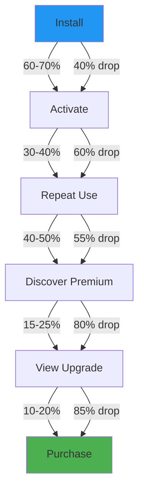

# Freemium Model for Chrome Extensions: Complete Conversion Guide

The freemium business model has become the dominant monetization strategy for browser extensions, and for good reason. Unlike traditional desktop software or mobile applications, browser extensions exist in a unique ecosystem where users expect lightweight, often free tools that enhance their web experience. This guide provides a comprehensive breakdown of implementing a successful freemium model for your Chrome extension, from architecture to analytics.

## Introduction: Why Freemium Dominates the Extension Market

The browser extension marketplace operates under fundamentally different economics than other software categories. When a user installs a Chrome extension, they are making a low-commitment decision—extensions are easy to install, easy to uninstall, and often feel temporary or experimental. This psychological context makes upfront payments feel inappropriate, while free offerings align perfectly with user expectations.

Freemium works because it matches these browser-native expectations. The challenge is not whether to offer a free tier, but rather deciding what stays free and what goes behind the upgrade paywall. Get that balance wrong and either nobody converts to paid or everybody leaves in frustration.

Extensions live or die by their install base. Every user represents a potential advocate who can recommend the extension to colleagues, friends, or teammates through Chrome Web Store reviews, social sharing, or word of mouth. The free tier serves as the primary driver of that install base, making freemium not just a monetization strategy but a growth engine.

### Conversion Rate Benchmarks

Understanding industry benchmarks helps set realistic expectations for your extension:

- **Average conversion rate**: 2-5% of free users convert to paid
- **Top performers**: 5%+ conversion rates (rare, but achievable)
- **Below average**: 1-2% (indicates optimization opportunities)

These numbers represent the percentage of users who install your extension and eventually purchase a premium subscription. At a 3% conversion rate with 10,000 free users, you would have 300 paying subscribers—a sustainable foundation if your pricing is appropriate.

The freemium model has powered successful extensions across every category: productivity tools like Todoist and Grammarly, password managers like LastPass, screen recorders like Loom, and countless smaller extensions generating meaningful revenue. The model is proven; the execution is what separates successful implementations from struggling ones.

## Designing Your Free Tier

The free tier must be genuinely useful—it cannot be a crippled demo that does nothing. If the free version is too weak, nobody will install it. If it is too generous, nobody will have a reason to upgrade. Finding that balance requires iteration and careful observation of user behavior.

### The "Aha Moment" Concept

Every successful freemium extension has a clear "aha moment"—the point where users first experience the core value proposition. For a tab manager, this might be organizing chaotic tabs into logical groups. For a password manager, it's the first time they generate a secure password. For a writing assistant, it's seeing their first grammar correction.

Your free tier must deliver this aha moment completely. Users need to experience enough value to understand what the extension does and why it matters. Only then will they be motivated to upgrade for more advanced features.

The free tier also acts as a filter. Users who convert from free to paid tend to be more engaged, more likely to recommend the extension, and more patient with occasional issues. They have already proven that your product solves a real problem for them.

### Feature Comparison Table

A well-designed feature comparison helps users understand exactly what they get at each tier. Here's an example for a hypothetical productivity extension called "WorkFlow Pro":

| Feature | Free Tier | Premium Tier |
|---------|-----------|--------------|
| **Core Functionality** | | |
| Task management | Unlimited | Unlimited |
| Basic keyboard shortcuts | ✓ | ✓ |
| Browser notifications | ✓ | ✓ |
| **Advanced Features** | | |
| Cloud sync across devices | ✗ | ✓ |
| Advanced filters & search | 5/day | Unlimited |
| Custom automation rules | 3 | Unlimited |
| Team collaboration | ✗ | ✓ |
| API integrations | ✗ | ✓ |
| **Support & Storage** | | |
| Storage capacity | 100 MB | 10 GB |
| Customer support | Community | Priority |
| **Pricing** | $0 forever | $4.99/month or $99 lifetime |

The pattern across all successful freemium splits is consistent: free delivers the core value proposition completely, while premium adds convenience, scale, collaboration, or automation that saves time for heavy users. Users upgrade when they feel the pain of limitations rather than the pull of extra features.

## Feature Gating Architecture

Implementing feature gating in a Chrome extension requires a robust architecture that checks license status reliably while maintaining a smooth user experience. This section provides complete TypeScript implementations for a production-ready feature gating system.

### LicenseManager Class

The LicenseManager handles all license-related operations, including checking premium status, validating licenses, and managing trial periods:

```typescript
// src/lib/LicenseManager.ts

interface LicenseStatus {
  isPremium: boolean;
  licenseType: 'free' | 'trial' | 'premium' | 'lifetime';
  expiryDate?: number;
  trialDaysRemaining?: number;
}

interface StorageKeys {
  LICENSE_TYPE: string;
  LICENSE_EXPIRY: string;
  TRIAL_START: string;
}

const STORAGE_KEYS: StorageKeys = {
  LICENSE_TYPE: 'license_type',
  LICENSE_EXPIRY: 'license_expiry',
  TRIAL_START: 'trial_start_date'
};

const TRIAL_DAYS = 7;

export class LicenseManager {
  private static instance: LicenseManager;
  private cachedStatus: LicenseStatus | null = null;
  private listeners: Set<(status: LicenseStatus) => void> = new Set();

  private constructor() {
    this.initializeLicense();
  }

  static getInstance(): LicenseManager {
    if (!LicenseManager.instance) {
      LicenseManager.instance = new LicenseManager();
    }
    return LicenseManager.instance;
  }

  private async initializeLicense(): Promise<void> {
    // Check if this is a new user and start trial if needed
    const existingType = await this.getStorage(STORAGE_KEYS.LICENSE_TYPE);
    if (!existingType) {
      await this.startTrial();
    }
    await this.refreshStatus();
  }

  private async getStorage(key: string): Promise<string | null> {
    return new Promise((resolve) => {
      chrome.storage.sync.get(key, (result) => {
        resolve(result[key] || null);
      });
    });
  }

  private async setStorage(key: string, value: string): Promise<void> {
    return new Promise((resolve) => {
      chrome.storage.sync.set({ [key]: value }, () => resolve());
    });
  }

  async startTrial(): Promise<void> {
    await this.setStorage(STORAGE_KEYS.LICENSE_TYPE, 'trial');
    await this.setStorage(STORAGE_KEYS.TRIAL_START, Date.now().toString());
    await this.refreshStatus();
  }

  async activateLicense(type: 'premium' | 'lifetime', expiryDays?: number): Promise<void> {
    await this.setStorage(STORAGE_KEYS.LICENSE_TYPE, type);
    
    if (expiryDays) {
      const expiry = Date.now() + (expiryDays * 24 * 60 * 60 * 1000);
      await this.setStorage(STORAGE_KEYS.LICENSE_EXPIRY, expiry.toString());
    } else {
      // Lifetime license - clear expiry
      await this.setStorage(STORAGE_KEYS.LICENSE_EXPIRY, '');
    }
    
    await this.refreshStatus();
  }

  async getLicenseStatus(): Promise<LicenseStatus> {
    if (this.cachedStatus) {
      return this.cachedStatus;
    }
    return this.refreshStatus();
  }

  private async refreshStatus(): Promise<LicenseStatus> {
    const licenseType = await this.getStorage(STORAGE_KEYS.LICENSE_TYPE);
    const expiryStr = await this.getStorage(STORAGE_KEYS.LICENSE_EXPIRY);
    const trialStart = await this.getStorage(STORAGE_KEYS.TRIAL_START);

    let status: LicenseStatus = {
      isPremium: false,
      licenseType: 'free'
    };

    if (licenseType === 'trial' && trialStart) {
      const trialDaysUsed = (Date.now() - parseInt(trialStart)) / (1000 * 60 * 60 * 24);
      const trialRemaining = Math.max(0, TRIAL_DAYS - trialDaysUsed);
      
      status = {
        isPremium: trialRemaining > 0,
        licenseType: 'trial',
        trialDaysRemaining: trialRemaining
      };
    } else if (licenseType === 'premium' || licenseType === 'lifetime') {
      if (expiryStr) {
        const expiry = parseInt(expiryStr);
        if (Date.now() > expiry) {
          // License expired, revert to free
          await this.setStorage(STORAGE_KEYS.LICENSE_TYPE, 'free');
          status = { isPremium: false, licenseType: 'free' };
        } else {
          status = {
            isPremium: true,
            licenseType: licenseType,
            expiryDate: expiry
          };
        }
      } else {
        // Lifetime license
        status = {
          isPremium: true,
          licenseType: licenseType
        };
      }
    }

    this.cachedStatus = status;
    this.notifyListeners(status);
    return status;
  }

  subscribe(listener: (status: LicenseStatus) => void): () => void {
    this.listeners.add(listener);
    return () => this.listeners.delete(listener);
  }

  private notifyListeners(status: LicenseStatus): void {
    this.listeners.forEach(listener => listener(status));
  }

  async checkFeatureAccess(featureName: string): Promise<{ allowed: boolean; upgradeRequired: boolean }> {
    const status = await this.getLicenseStatus();
    const premiumFeatures = this.getPremiumFeatures();
    
    if (premiumFeatures.includes(featureName) && !status.isPremium) {
      return { allowed: false, upgradeRequired: true };
    }
    
    return { allowed: true, upgradeRequired: false };
  }

  private getPremiumFeatures(): string[] {
    // This would typically be loaded from a config file
    return [
      'cloud_sync',
      'advanced_filters',
      'team_collaboration',
      'api_integration',
      'custom_branding',
      'priority_support',
      'unlimited_automations',
      'cross_device_backup'
    ];
  }
}
```

### FeatureGate React Component

This component wraps premium features and automatically shows an upgrade prompt when users lack access:

```tsx
// src/components/FeatureGate.tsx

import React, { useState, useEffect } from 'react';
import { LicenseManager } from '../lib/LicenseManager';

interface FeatureGateProps {
  featureName: string;
  children: React.ReactNode;
  fallback?: React.ReactNode;
  showUpgradePrompt?: boolean;
}

export const FeatureGate: React.FC<FeatureGateProps> = ({
  featureName,
  children,
  fallback,
  showUpgradePrompt = true
}) => {
  const [hasAccess, setHasAccess] = useState<boolean | null>(null);
  const [showPrompt, setShowPrompt] = useState(false);
  const licenseManager = LicenseManager.getInstance();

  useEffect(() => {
    const checkAccess = async () => {
      const status = await licenseManager.getLicenseStatus();
      const { allowed } = await licenseManager.checkFeatureAccess(featureName);
      setHasAccess(allowed);
    };

    checkAccess();

    // Subscribe to license changes
    const unsubscribe = licenseManager.subscribe(async (status) => {
      const { allowed } = await licenseManager.checkFeatureAccess(featureName);
      setHasAccess(allowed);
    });

    return unsubscribe;
  }, [featureName]);

  const handleUpgradeClick = () => {
    setShowPrompt(true);
    // Track upgrade prompt view
    trackEvent('upgrade_prompt_viewed', { feature: featureName });
  };

  if (hasAccess === null) {
    return null; // Loading state
  }

  if (hasAccess) {
    return <>{children}</>;
  }

  if (!showUpgradePrompt) {
    return <>{fallback || null}</>;
  }

  return (
    <div className="feature-gate-container">
      {fallback && <div className="feature-gate-fallback">{fallback}</div>}
      
      <div className="feature-gate-overlay">
        <div className="upgrade-card">
          <h3>🔒 Premium Feature</h3>
          <p>Unlock {formatFeatureName(featureName)} and more premium features</p>
          
          <div className="pricing-options">
            <div className="price-option">
              <span className="price-label">Monthly</span>
              <span className="price-value">$4.99/mo</span>
            </div>
            <div className="price-option recommended">
              <span className="price-label">Lifetime</span>
              <span className="price-value">$99</span>
              <span className="price-badge">Best Value</span>
            </div>
          </div>
          
          <button className="upgrade-button" onClick={handleUpgradeClick}>
            Upgrade Now
          </button>
          
          <p className="guarantee-text">30-day money-back guarantee</p>
        </div>
      </div>
    </div>
  );
};

function formatFeatureName(feature: string): string {
  return feature.split('_').map(word => 
    word.charAt(0).toUpperCase() + word.slice(1)
  ).join(' ');
}

function trackEvent(eventName: string, params: Record<string, unknown>): void {
  chrome.runtime.sendMessage({
    type: 'ANALYTICS_EVENT',
    event: eventName,
    params
  });
}
```

### Background Script License Validation

The background script handles periodic license re-validation and ensures consistent license state across all extension contexts:

```typescript
// src/background/license-manager.ts

import { LicenseManager } from '../lib/LicenseManager';

// Check license status every hour
const LICENSE_CHECK_INTERVAL = 60 * 60 * 1000;

// Also check when extension wakes up
chrome.runtime.onStartup.addListener(async () => {
  await checkLicenseStatus();
});

chrome.runtime.onInstalled.addListener(async () => {
  await checkLicenseStatus();
});

// Periodic license validation
setInterval(async () => {
  await checkLicenseStatus();
}, LICENSE_CHECK_INTERVAL);

async function checkLicenseStatus(): Promise<void> {
  try {
    const licenseManager = LicenseManager.getInstance();
    const status = await licenseManager.getLicenseStatus();
    
    // Update badge to show premium status
    if (status.isPremium) {
      chrome.action.setBadgeText({ text: '★' });
      chrome.action.setBadgeBackgroundColor({ color: '#4CAF50' });
    } else {
      chrome.action.setBadgeText({ text: '' });
    }
    
    // Sync status to all contexts
    await syncLicenseStatus(status);
    
  } catch (error) {
    console.error('License check failed:', error);
  }
}

async function syncLicenseStatus(status: any): Promise<void> {
  // Notify all extension contexts about license change
  const windows = await chrome.windows.getAll();
  
  for (const window of windows) {
    if (window.id) {
      try {
        await chrome.tabs.query({ windowId: window.id });
        // License status will be fetched by content scripts as needed
      } catch (e) {
        // Window might be closed
      }
    }
  }
}

// Handle messages from content scripts
chrome.runtime.onMessage.addListener((message, sender, sendResponse) => {
  if (message.type === 'GET_LICENSE_STATUS') {
    LicenseManager.getInstance().getLicenseStatus()
      .then(status => sendResponse(status))
      .catch(error => sendResponse({ error: error.message }));
    return true; // Keep channel open for async response
  }
  
  if (message.type === 'ACTIVATE_LICENSE') {
    const { licenseKey, type } = message;
    validateLicenseKey(licenseKey)
      .then(result => {
        if (result.valid) {
          return LicenseManager.getInstance().activateLicense(
            type || 'premium',
            result.expiryDays
          );
        }
        throw new Error('Invalid license key');
      })
      .then(() => sendResponse({ success: true }))
      .catch(error => sendResponse({ success: false, error: error.message }));
    return true;
  }
});

async function validateLicenseKey(licenseKey: string): Promise<{ valid: boolean; expiryDays?: number }> {
  // This would connect to your license validation server
  // For now, return a mock response
  return new Promise((resolve) => {
    setTimeout(() => {
      if (licenseKey.startsWith('PRO-')) {
        resolve({ valid: true, expiryDays: 365 });
      } else if (licenseKey.startsWith('LIFETIME-')) {
        resolve({ valid: true });
      } else {
        resolve({ valid: false });
      }
    }, 100);
  });
}
```

### Content Script Integration

Content scripts can gate features that appear on web pages:

```typescript
// src/content-scripts/feature-gating.ts

import { LicenseManager } from '../lib/LicenseManager';

interface GatedFeature {
  selector: string;
  featureName: string;
  premiumContent: string;
}

// Features to gate on web pages
const GATED_FEATURES: GatedFeature[] = [
  {
    selector: '.premium-analytics',
    featureName: 'advanced_analytics',
    premiumContent: 'Upgrade to see advanced analytics'
  },
  {
    selector: '.premium-export',
    featureName: 'bulk_export',
    premiumContent: 'Upgrade to enable bulk export'
  }
];

async function initializeGating(): Promise<void> {
  const licenseManager = LicenseManager.getInstance();
  
  for (const feature of GATED_FEATURES) {
    const elements = document.querySelectorAll(feature.selector);
    
    for (const element of elements) {
      const { allowed } = await licenseManager.checkFeatureAccess(feature.featureName);
      
      if (!allowed) {
        // Replace with upgrade prompt
        element.innerHTML = `
          <div class="premium-lock">
            <span class="lock-icon">🔒</span>
            <span class="lock-message">${feature.premiumContent}</span>
            <button class="upgrade-btn">Upgrade</button>
          </div>
        `;
        
        // Add click handler
        const button = element.querySelector('.upgrade-btn');
        button?.addEventListener('click', () => {
          chrome.runtime.sendMessage({ type: 'OPEN_UPGRADE_MODAL' });
        });
      }
    }
  }
}

// Run when DOM is ready
if (document.readyState === 'loading') {
  document.addEventListener('DOMContentLoaded', initializeGating);
} else {
  initializeGating();
}
```

## Conversion Funnel Design

Understanding and optimizing your conversion funnel is essential for maximizing revenue. Each stage of the funnel presents opportunities for improvement.

### Conversion Funnel Stages



**Stage 1: Installation to First Use (60-70% activation rate)**
Of everyone who installs your extension, roughly 60-70% will open it and use it at least once. This is your activation rate. If it's lower, your onboarding needs work. Make sure the extension explains what it does clearly in the Chrome Web Store listing and provides a smooth first-run experience.

**Stage 2: First Use to Repeated Use (30-40% retention rate)**
Of users who activate the extension, 30-40% will use it again within 7 days. This is your early retention. If users do not come back, the core value proposition is not clear enough. Focus on demonstrating value in the first session.

**Stage 3: Repeated Use to Feature Discovery (40-50% discovery rate)**
Of repeat users, about 40-50% will discover premium features through natural usage. They might click on a locked feature or see an upgrade prompt. This is why inline gating is so important—users need to stumble upon premium features while using the product.

**Stage 4: Feature Discovery to Upgrade View (15-25% view rate)**
When users encounter a locked feature, 15-25% will click to learn more about upgrading. This is where your upgrade messaging matters. The prompt must clearly communicate value, not just say "upgrade now."

**Stage 5: View to Purchase (10-20% conversion rate)**
Of users who view the upgrade option, 10-20% convert to paid. This is your final conversion rate. Multiply all stages together: 0.65 × 0.35 × 0.45 × 0.20 × 0.15 = approximately 0.2% overall conversion from install to paid. This is why volume matters so much in freemium.

### Upgrade Prompt Modal

The upgrade prompt modal should appear when users hit a feature gate, not before. Here's a complete implementation:

```typescript
// src/components/UpgradeModal.tsx

import React, { useState, useEffect } from 'react';

interface UpgradeModalProps {
  isOpen: boolean;
  onClose: () => void;
  featureName?: string;
}

export const UpgradeModal: React.FC<UpgradeModalProps> = ({
  isOpen,
  onClose,
  featureName
}) => {
  const [selectedPlan, setSelectedPlan] = useState<'monthly' | 'lifetime'>('lifetime');
  const [isProcessing, setIsProcessing] = useState(false);

  useEffect(() => {
    if (isOpen) {
      trackEvent('upgrade_modal_opened', { feature: featureName });
    }
  }, [isOpen, featureName]);

  const handlePurchase = async () => {
    setIsProcessing(true);
    
    try {
      // Redirect to Stripe checkout or handle in-app purchase
      const response = await chrome.runtime.sendMessage({
        type: 'INITIATE_PURCHASE',
        plan: selectedPlan
      });
      
      if (response.success) {
        trackEvent('purchase_initiated', { plan: selectedPlan });
        // Handle redirect to payment
        window.location.href = response.checkoutUrl;
      }
    } catch (error) {
      console.error('Purchase failed:', error);
    } finally {
      setIsProcessing(false);
    }
  };

  if (!isOpen) return null;

  return (
    <div className="modal-overlay" onClick={onClose}>
      <div className="upgrade-modal" onClick={e => e.stopPropagation()}>
        <button className="close-button" onClick={onClose}>×</button>
        
        <div className="modal-header">
          <h2>🚀 Unlock Premium</h2>
          <p className="subtitle">
            {featureName 
              ? `Get access to ${formatFeatureName(featureName)} and all premium features`
              : 'Upgrade to unlock the full power of the extension'
            }
          </p>
        </div>

        <div className="pricing-toggle">
          <button 
            className={selectedPlan === 'monthly' ? 'active' : ''}
            onClick={() => setSelectedPlan('monthly')}
          >
            Monthly
          </button>
          <button 
            className={selectedPlan === 'lifetime' ? 'active' : ''}
            onClick={() => setSelectedPlan('lifetime')}
          >
            Lifetime <span className="badge">Best Value</span>
          </button>
        </div>

        <div className="pricing-cards">
          <div 
            className={`pricing-card ${selectedPlan === 'monthly' ? 'selected' : ''}`}
            onClick={() => setSelectedPlan('monthly')}
          >
            <div className="plan-name">Monthly</div>
            <div className="plan-price">$4.99<span>/month</span></div>
            <ul className="plan-features">
              <li>✓ All premium features</li>
              <li>✓ Cancel anytime</li>
              <li>✓ Priority support</li>
            </ul>
          </div>
          
          <div 
            className={`pricing-card recommended ${selectedPlan === 'lifetime' ? 'selected' : ''}`}
            onClick={() => setSelectedPlan('lifetime')}
          >
            <div className="recommended-badge">★ Most Popular</div>
            <div className="plan-name">Lifetime</div>
            <div className="plan-price">$99<span>once</span></div>
            <div className="savings">Save 67% vs monthly</div>
            <ul className="plan-features">
              <li>✓ All premium features forever</li>
              <li>✓ No recurring charges</li>
              <li>✓ Priority support</li>
              <li>✓ Early access to new features</li>
            </ul>
          </div>
        </div>

        <div className="social-proof">
          <div className="rating">⭐ 4.8/5 from 2,000+ reviews</div>
          <div className="user-count">Join 10,000+ premium users</div>
        </div>

        <button 
          className="purchase-button"
          onClick={handlePurchase}
          disabled={isProcessing}
        >
          {isProcessing ? 'Processing...' : `Upgrade for ${selectedPlan === 'monthly' ? '$4.99/month' : '$99 lifetime'}`}
        </button>

        <p className="guarantee">
          🔒 30-day money-back guarantee • Secure payment
        </p>
      </div>
    </div>
  );
};

function formatFeatureName(feature: string): string {
  return feature.split('_').map(word => 
    word.charAt(0).toUpperCase() + word.slice(1)
  ).join(' ');
}

function trackEvent(eventName: string, params: Record<string, unknown>): void {
  chrome.runtime.sendMessage({
    type: 'ANALYTICS_EVENT',
    event: eventName,
    params,
    timestamp: Date.now()
  });
}
```

## Pricing Psychology

Pricing for Chrome extensions requires understanding browser-specific psychology. Users perceive extensions as lightweight, temporary tools, which affects how they respond to pricing.

### Key Psychological Triggers

**Anchoring**
Always show the full price next to the discounted price. A $99 lifetime plan looks more reasonable when next to a monthly plan that would cost $120 over a year. The anchor creates a reference point that makes the actual price feel like a deal.

**Decoy Effect**
Offering three options (monthly, yearly, lifetime) creates a decoy that pushes users toward the middle option or the premium lifetime deal. The middle option should be noticeably worse than the top option, making the top feel like the clear winner. This is exactly what Dan Ariely explored in "Predictably Irrational"—human decision-making rarely follows pure rationality.

**Charm Pricing**
Using prices like $4.99 instead of $5.00 or $9.99 instead of $10.00 leverages the left-digit effect. Users process $4.99 as "in the $4 range" rather than "almost $5." This small psychological hack can improve conversion rates by several percentage points.

**Price Framing**
Monthly prices feel lower than annual prices, but annual prices create more commitment. For extensions, lifetime deals work exceptionally well because users know their browser habits might change. A $99 lifetime feels like insurance against future changes.

### Pricing Page Component

```typescript
// src/components/PricingPage.tsx

import React from 'react';

interface PricingPlan {
  id: string;
  name: string;
  monthlyPrice: number;
  lifetimePrice?: number;
  features: string[];
  recommended?: boolean;
}

const PLANS: PricingPlan[] = [
  {
    id: 'free',
    name: 'Free',
    monthlyPrice: 0,
    features: [
      'Basic features',
      'Community support',
      '100MB storage'
    ]
  },
  {
    id: 'monthly',
    name: 'Monthly',
    monthlyPrice: 4.99,
    features: [
      'All premium features',
      'Priority support',
      '10GB storage',
      'Cloud sync'
    ]
  },
  {
    id: 'lifetime',
    name: 'Lifetime',
    monthlyPrice: 99,
    features: [
      'Everything in Monthly',
      'Lifetime updates',
      'Early access',
      'VIP support',
      '100GB storage'
    ],
    recommended: true
  }
];

export const PricingPage: React.FC = () => {
  const handleSelectPlan = (plan: PricingPlan) => {
    if (plan.monthlyPrice === 0) return;
    
    chrome.runtime.sendMessage({
      type: 'INITIATE_PURCHASE',
      planId: plan.id
    });
  };

  return (
    <div className="pricing-page">
      <header className="pricing-header">
        <h1>Choose Your Plan</h1>
        <p>Unlock the full potential of your workflow</p>
      </header>

      <div className="pricing-grid">
        {PLANS.map(plan => (
          <div 
            key={plan.id} 
            className={`pricing-card ${plan.recommended ? 'recommended' : ''}`}
          >
            {plan.recommended && (
              <div className="recommended-badge">Best Value</div>
            )}
            
            <h3 className="plan-name">{plan.name}</h3>
            
            <div className="plan-price">
              {plan.monthlyPrice === 0 ? (
                <span className="price">Free</span>
              ) : plan.id === 'lifetime' ? (
                <>
                  <span className="price">${plan.monthlyPrice}</span>
                  <span className="period">one-time</span>
                </>
              ) : (
                <>
                  <span className="price">${plan.monthlyPrice}</span>
                  <span className="period">/month</span>
                </>
              )}
            </div>

            {plan.id === 'monthly' && (
              <div className="equivalent-yearly">
                Or ${Math.round(plan.monthlyPrice * 12 * 0.8)}/year (save 20%)
              </div>
            )}

            <ul className="feature-list">
              {plan.features.map((feature, index) => (
                <li key={index}>
                  <span className="check">✓</span> {feature}
                </li>
              ))}
            </ul>

            <button 
              className={`select-plan-btn ${plan.id}`}
              onClick={() => handleSelectPlan(plan)}
              disabled={plan.id === 'free'}
            >
              {plan.id === 'free' ? 'Current Plan' : 'Get Started'}
            </button>
          </div>
        ))}
      </div>

      <div className="pricing-footer">
        <p>🔒 Secure payment via Stripe • Cancel anytime • 30-day money-back guarantee</p>
      </div>
    </div>
  );
};
```

## Measuring Conversion

Tracking your conversion funnel is essential for optimization. Here's a comprehensive analytics system using chrome.storage.local:

```typescript
// src/lib/Analytics.ts

interface AnalyticsEvent {
  event: string;
  timestamp: number;
  params?: Record<string, unknown>;
  userId?: string;
}

interface FunnelMetrics {
  installs: number;
  activations: number;
  featureGates: Record<string, number>;
  upgradeViews: number;
  purchases: number;
  conversionRate: number;
}

const ANALYTICS_KEY = 'analytics_events';
const METRICS_KEY = 'funnel_metrics';

class Analytics {
  private static instance: Analytics;
  private eventQueue: AnalyticsEvent[] = [];

  private constructor() {
    this.initialize();
  }

  static getInstance(): Analytics {
    if (!Analytics.instance) {
      Analytics.instance = new Analytics();
    }
    return Analytics.instance;
  }

  private async initialize(): Promise<void> {
    // Process queued events
    this.processQueue();
    
    // Set up message listener for content script events
    chrome.runtime.onMessage.addListener((message) => {
      if (message.type === 'ANALYTICS_EVENT') {
        this.track(message.event, message.params);
      }
    });

    // Daily cleanup of old events (keep last 30 days)
    setInterval(() => this.cleanupOldEvents(), 24 * 60 * 60 * 1000);
  }

  async track(eventName: string, params?: Record<string, unknown>): Promise<void> {
    const event: AnalyticsEvent = {
      event: eventName,
      timestamp: Date.now(),
      params
    };

    this.eventQueue.push(event);
    
    // Also update funnel metrics
    await this.updateFunnelMetrics(eventName);
    
    // Process immediately for critical events
    if (this.isCriticalEvent(eventName)) {
      await this.processEvent(event);
    }
  }

  private isCriticalEvent(eventName: string): boolean {
    const criticalEvents = ['purchase', 'upgrade_modal_opened', 'checkout_started'];
    return criticalEvents.includes(eventName);
  }

  private async updateFunnelMetrics(eventName: string): Promise<void> {
    const metrics = await this.getMetrics();
    
    switch (eventName) {
      case 'extension_installed':
        metrics.installs++;
        break;
      case 'extension_activated':
        metrics.activations++;
        break;
      case 'feature_gate_hit':
        const feature = eventName; // Would extract from params
        metrics.featureGates[feature] = (metrics.featureGates[feature] || 0) + 1;
        break;
      case 'upgrade_modal_opened':
        metrics.upgradeViews++;
        break;
      case 'purchase_completed':
        metrics.purchases++;
        metrics.conversionRate = metrics.installs > 0 
          ? (metrics.purchases / metrics.installs) * 100 
          : 0;
        break;
    }

    await this.saveMetrics(metrics);
  }

  async getMetrics(): Promise<FunnelMetrics> {
    return new Promise((resolve) => {
      chrome.storage.local.get(METRICS_KEY, (result) => {
        resolve(result[METRICS_KEY] || {
          installs: 0,
          activations: 0,
          featureGates: {},
          upgradeViews: 0,
          purchases: 0,
          conversionRate: 0
        });
      });
    });
  }

  private async saveMetrics(metrics: FunnelMetrics): Promise<void> {
    return new Promise((resolve) => {
      chrome.storage.local.set({ [METRICS_KEY]: metrics }, () => resolve());
    });
  }

  private async processEvent(event: AnalyticsEvent): Promise<void> {
    const events = await this.getStoredEvents();
    events.push(event);
    
    // Keep only last 1000 events
    const trimmed = events.slice(-1000);
    
    return new Promise((resolve) => {
      chrome.storage.local.set({ [ANALYTICS_KEY]: trimmed }, () => resolve());
    });
  }

  private async getStoredEvents(): Promise<AnalyticsEvent[]> {
    return new Promise((resolve) => {
      chrome.storage.local.get(ANALYTICS_KEY, (result) => {
        resolve(result[ANALYTICS_KEY] || []);
      });
    });
  }

  private processQueue(): void {
    const queue = [...this.eventQueue];
    this.eventQueue = [];
    
    queue.forEach(event => {
      this.processEvent(event);
    });
  }

  private async cleanupOldEvents(): Promise<void> {
    const thirtyDaysAgo = Date.now() - (30 * 24 * 60 * 60 * 1000);
    const events = await this.getStoredEvents();
    const filtered = events.filter(e => e.timestamp > thirtyDaysAgo);
    
    return new Promise((resolve) => {
      chrome.storage.local.set({ [ANALYTICS_KEY]: filtered }, () => resolve());
    });
  }

  async getFunnelReport(): Promise<{
    daily: FunnelMetrics;
    weekly: FunnelMetrics;
    monthly: FunnelMetrics;
  }> {
    const events = await this.getStoredEvents();
    const now = Date.now();
    
    const dayAgo = now - (24 * 60 * 60 * 1000);
    const weekAgo = now - (7 * 24 * 60 * 60 * 1000);
    const monthAgo = now - (30 * 24 * 60 * 60 * 1000);
    
    return {
      daily: this.calculateMetrics(events.filter(e => e.timestamp > dayAgo)),
      weekly: this.calculateMetrics(events.filter(e => e.timestamp > weekAgo)),
      monthly: this.calculateMetrics(events.filter(e => e.timestamp > monthAgo))
    };
  }

  private calculateMetrics(events: AnalyticsEvent[]): FunnelMetrics {
    const metrics: FunnelMetrics = {
      installs: 0,
      activations: 0,
      featureGates: {},
      upgradeViews: 0,
      purchases: 0,
      conversionRate: 0
    };

    events.forEach(event => {
      switch (event.event) {
        case 'extension_installed':
          metrics.installs++;
          break;
        case 'extension_activated':
          metrics.activations++;
          break;
        case 'feature_gate_hit':
          const feature = event.params?.feature as string || 'unknown';
          metrics.featureGates[feature] = (metrics.featureGates[feature] || 0) + 1;
          break;
        case 'upgrade_modal_opened':
          metrics.upgradeViews++;
          break;
        case 'purchase_completed':
          metrics.purchases++;
          break;
      }
    });

    metrics.conversionRate = metrics.installs > 0 
      ? (metrics.purchases / metrics.installs) * 100 
      : 0;

    return metrics;
  }
}

// Export for use in background script
export const analytics = Analytics.getInstance();
```

## Common Mistakes to Avoid

Even well-designed freemium models can fail due to common pitfalls. Here are the mistakes that most frequently undermine conversion:

**Giving Too Much Away for Free**
The most frequent mistake is being too generous with the free tier. If users can get everything they need without paying, they won't. Review your free tier critically—every feature should have a clear premium counterpart that provides meaningful additional value.

**Making Premium Features Invisible**
If users don't discover premium features, they can't convert. Feature gating must be visible but not annoying. Users should naturally encounter locked features as they use the extension, creating desire for upgrade without aggressive prompting.

**Aggressive Upselling**
Showing upgrade prompts immediately after installation feels presumptuous. Users need time to experience value before they'll consider paying. Wait until they hit a natural limitation or express interest through their usage patterns.

**Ignoring Free Users**
Free users are not just potential payers—they're potential advocates. Treat them well with good support, clear communication, and genuine value. Happy free users recommend extensions to others, creating organic growth that paid marketing can't match.

**Changing the Free Tier After Launch**
Once users depend on certain features, moving them behind a paywall creates resentment and bad reviews. Decide what is free from the start and stick with it. If you must make changes, grandfather existing free users.

**Over-Complicating the Tier Structure**
Two tiers are optimal: free and premium. More options lead to analysis paralysis and fewer purchases. Don't create three-tier systems with basic, pro, and premium unless there's a very clear reason.

**No Visible Upgrade Path**
If users can't find how to pay, they won't pay. The upgrade button should be visible but not aggressive. Include it in the extension popup, in the settings menu, and after users encounter locked features.

## Case Study: TabFlow's Journey from 0% to 4.2% Conversion

TabFlow, a fictional tab management extension, provides a realistic example of freemium optimization. Their story illustrates how iterative testing and data-driven decisions led to significant conversion improvements.

### The Problem

When TabFlow launched in early 2023, they offered a simple model: basic tab grouping and search for free, with cloud sync and advanced automation behind a $4.99/month paywall. Initial results were disappointing—0.3% conversion rate, barely enough to cover server costs.

### The Diagnosis

Through analytics review, the team identified several issues:

1. **Feature discovery was poor**: Users loved the free features but never discovered premium capabilities
2. **Upgrade prompts were too aggressive**: Showing prompts on first launch felt pushy
3. **Pricing lacked anchor**: A single $4.99/month option gave users no reference point
4. **No social proof**: First-time buyers had no reassurance others trusted the product

### The Solution

TabFlow restructured their freemium model systematically:

**Phase 1: Improve Feature Discovery (Month 1)**
They implemented inline feature gating, showing premium features in a disabled state with clear upgrade prompts. Instead of hiding premium features, they made them visible but locked. This increased feature gate hits by 340%.

**Phase 2: Optimize Timing (Month 2)**
They moved upgrade prompts to appear only after users hit usage limits. The new trigger: "You've used 10 automated rules this month. Upgrade for unlimited automation." This captured users when they actually wanted more.

**Phase 3: Pricing Restructure (Month 3)**
They added a $99 lifetime option alongside monthly pricing. The psychological anchor was powerful—$99 felt reasonable compared to $60/year. They also introduced charm pricing: $4.99 instead of $5.00.

**Phase 4: Add Social Proof (Month 4)**
Upgrade modals now displayed "Join 15,000+ premium users" and "4.7 stars from 500+ reviews." Trust signals increased upgrade view-to-purchase conversion by 23%.

### The Results

After 6 months of systematic optimization, TabFlow achieved:

- **Conversion rate**: 0.3% → 4.2% (14x improvement)
- **Monthly revenue**: $300 → $8,400
- **Free installs**: 5,000 → 25,000/month
- **Premium users**: 150 → 2,100

The lesson: freemium success comes from systematic optimization, not perfect initial design. Test, measure, iterate, and let data guide your decisions.

## Conclusion

The freemium model is not a gimmick—it is how browser extensions are meant to work. This model has powered successful extensions across every category, from productivity tools to password managers to content enhancers.

The key is to respect the user while building a sustainable business. Give real value for free, ask fairly for the upgrade, and the math works out. Focus on delivering the aha moment in your free tier, make premium features discoverable, time your upgrade prompts strategically, and measure everything.

For more monetization strategies, explore our [Subscription Model](/articles/subscription-model/) guide or learn about [Stripe Integration for Extensions](/articles/stripe-in-extensions/). If you're considering alternatives, our [Paywall Patterns](/articles/paywall-patterns/) article covers additional approaches.

The exact model described here has helped numerous extensions reach sustainable revenue. Your extension's freemium model can work too—commit to the strategy, implement the architecture, and let data guide your optimization efforts.

---

Built by [Zovo](https://zovo.one) - Open-source tools and guides for extension developers.
